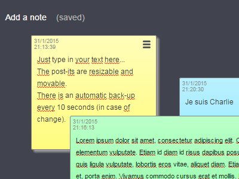

<!--
NOTA: Este README foi creado automáticamente por <https://github.com/YunoHost/apps/tree/master/tools/readme_generator>
NON debe editarse manualmente.
-->

# ChtickyNotes para YunoHost

[](https://dash.yunohost.org/appci/app/chtickynotes)  

[](https://install-app.yunohost.org/?app=chtickynotes)

*[Le este README en outros idiomas.](./ALL_README.md)*

> *Este paquete permíteche instalar ChtickyNotes de xeito rápido e doado nun servidor YunoHost.*  
> *Se non usas YunoHost, le a [documentación](https://yunohost.org/install) para saber como instalalo.*

## Vista xeral

ChtickyNotes is a "simple post-it" based on [Post It All!](https://github.com/txusko/PostItAll).

## Features

- notes movable and resizable
- edit note by just typing on it (or CTRL-V to paste chunks of HTML)
- menu on each note to change its color, and so on
- global menu to change board, and so on
- autosave every 10 seconds
- storage on the server (not on the browser local storage)


**Versión proporcionada:** 1.0~ynh6

## Capturas de pantalla



## :red_circle: Caraterísticas cuestionables

- **Upstream not maintained**: This software is not maintained anymore. Expect it to break down over time, be exposed to unfixed security breaches, etc.

## Documentación e recursos

- Repositorio de orixe do código: <https://github.com/YunoHost-Apps/chtickynotes_ynh/>
- Tenda YunoHost: <https://apps.yunohost.org/app/chtickynotes>
- Informar dun problema: <https://github.com/YunoHost-Apps/chtickynotes_ynh/issues>

## Info de desenvolvemento

Envía a túa colaboración á [rama `testing`](https://github.com/YunoHost-Apps/chtickynotes_ynh/tree/testing).

Para probar a rama `testing`, procede deste xeito:

```bash
sudo yunohost app install https://github.com/YunoHost-Apps/chtickynotes_ynh/tree/testing --debug
ou
sudo yunohost app upgrade chtickynotes -u https://github.com/YunoHost-Apps/chtickynotes_ynh/tree/testing --debug
```

**Máis info sobre o empaquetado da app:** <https://yunohost.org/packaging_apps>
